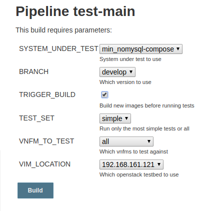

  

  Copyright © 2015-2017 [Open Baton](http://openbaton.org).
  Licensed under [Apache v2 License](http://www.apache.org/licenses/LICENSE-2.0).


# Open Baton Continuous Integration with Jenkins Pipelines

# Table of Contents
1. [Introduction](#introduction)
2. [Setup](#setup)
3. [Repository structure](#repository-structure)
4. [Jenkins usage and configuration](#jenkins-usage-and-configuration)
5. [Pipelines tl;dr](#pipelines-tldr)
6. [Add vim-instance](#add-vim-instance)
7. [Add integration-test](#add-integration-test)

## Introduction
With multiple possible deployment configurations and multiple test suits to cover most use cases, testing gets overwhelmingly complex.

To achieve continuous integration and delivery the used automation technique should be flexible and extend able. We will be using Jenkins new [Declarative Pipelines](https://jenkins.io/doc/book/pipeline/) and [Docker Compose](https://docs.docker.com/compose/) to provide the possibility of automatic package buildlng, build checking and testing of different system under test against the already existing [integration-tests](https://github.com/openbaton/integration-tests)
## Setup
This has been tested on the following deployment
- `Ubuntu 16.04`
- `Jenkins 2.60.2`
- `Docker 17.06.0-ce`
- `Docker Compose 1.14.0`


This video showcase the installation procedure further outlined in the next sections.

[](https://asciinema.org/a/153899)

### Docker, Docker-Compose, and Jenkins

Install Docker-CE and build the Jenkins docker image

```bash
./01-setup.sh
```

Modify the docker configuration adding the following line for exposing the port remotely

```bash
sudo vim /etc/systemd/system/multi-user.target.wants/docker.service
ExecStart=/usr/bin/dockerd -H fd:// -H tcp://0.0.0.0:2376
```

Afterwards, restart docker:

```bash
sudo systemctl daemon-reload && sudo systemctl restart docker
```

Copy the private key under jenkins/config

```bash
cp id_rsa jenkins/config/integration-test.key
```

### Start Jenkins

Install Jenkins using the official docker image:

```bash
./02-start-jenkins.sh
```

Do the initial configure steps, and check the logs using the following commands:

```bash
docker logs -f openbaton-ci
```

Get the needed key for authenticating at: `http://IP_OF_JENKINS:9090`. Choose a username and password for the admin user and skip through the default configuration.


## Repository structure
- `master`: contains this README
- `build-docker`: builds docker container for all java components, branch to be build selectable
- `run-every_night`: runs test-main every night with predefined parameters
- `test-main`: entry point pipeline to run integration tests
- `test-dummy`: sub job to run the relevant tests for amqp/rest vnfm
- `test-generic`: sub job to run the relevant tests for generic
- `test-arbitrary-branches`: entry point pipeline to run tests against self defined branch compositions
- `test-bootstrap-config`: entry point pipeline to run the bootstrap install script against multiple configurations and distributions
- `test-db_upgrade`: entry point pipeline to check if the database migration between two tags or branches works correctly

This repository is added as a [Multibranch Pipeline](https://jenkins.io/doc/book/pipeline/multibranch/). All repositories including a pipeline must include a single `Jenkinsfile`. Jenkins automatically pulls the branch on run and then executes the found `Jenkinsfile`. New branches will be found as well.


## Jenkins usage and configuration

### Integration tests
To run the integration test suite manually against a docker-compose system under test, start the `test-main` pipeline with parameters (drop down point+click).

### Environment variables
Because the integration tests need some "node specific" configuration (i.e. real-vim file, configuration files, ssh-key), paths to the files in `config` folder are setup as environmental variables in the jenkins master node.
This way, they are easily accessible in the pipeline steps, for example regarding the actual host ip or path to the private key.
Those can be set up through `Manage Jenkins -> Manage Nodes -> Settings wheel -> Node properties`, in our case the master node.

#### Used environment variables
- `HOST_IP`: IP of the node (needed for ems and docker-compose)
- `CONFIG`: Path to integration-tests configuration (i.e. /home/ubuntu/jenkins/config)
- `VIM_FILES`: Path to vim files (i.e. /home/ubuntu/jenkins/config/pop)

Please be sure to provide a working default vimfile called `pop.json` inside your `VIM_FILES` folder, this will be used in your pipelines if not specifically overwritten. Information how to create your `pop.json` can be found [here](https://openbaton.github.io/documentation/pop-registration/)
## Pipelines tldr
### Docker compose files
- `min-compose`: nfvo, generic/dummy-rest/dummy-amqp vnfms, rabbitmq, mysql
- `min_nomysql-compose`: as above, but with in memory db (fastest deploy)
- `full-compose`: Full deployment with all external components. No sense in using yet as there are no tests for the components
- `dockervnfm-compose`: Deployment of nfvo, generic- and docker-vnfm, rabbitmq, mysql

### Periodic or hooked builds
To set a pipeline to automatically build based on cron-style times, see the example pipeline for [every night](https://github.com/openbaton/openbaton-ci/blob/dd58f3f88719edee5b453fd2aac34bad95da7c0a/Jenkinsfile#L8). The syntax is described [here](https://jenkins.io/doc/book/pipeline/syntax/#triggers). If unfamiliar with cron-style strings, check [here](https://crontab-generator.org/).

Relevant links for webhook based integrations:
- https://thepracticalsysadmin.com/setting-up-a-github-webhook-in-jenkins/
- https://gist.github.com/misterbrownlee/3708738

The current implementation of the `after commit` trigger is polling the relevant repositories every 5 minutes and only starts a test-run if changes are detected.

## Add vim-instance
Add the JSON file to the correct folder on your deployment, as configured in the environment variables. As naming convetion, use the IP of the used testbed. Add the name (without .json suffix) to the choice parameter in [test-main](https://github.com/openbaton/openbaton-ci/blob/3b51eb23716174650fa50a2ee6aa39e6f4bdfe75/Jenkinsfile#L31). It will be available after the next scm checkout of this branch.

## Add integration-test
After adding the test to the integration-tests, add a new stage corresponding to the new scenario to either the [vnfm-dummy](https://github.com/openbaton/openbaton-ci/blob/23f21a5d2e70248b9f365fc9ba8c175b284a3efc/Jenkinsfile#L6) or [vnfm-generic](https://github.com/openbaton/openbaton-ci/blob/280abc2178442318e86bda19660ab6b13f04230b/Jenkinsfile#L6) Pipeline.

When running e.g. `test-main` be sure to include `trigger build` as seen in this image. This is needed because the integration-test container has to be rebuild to include any changes.


### Add it to the parameters
Include it in the possible `TEST_SET` [choices](https://github.com/openbaton/openbaton-ci/blob/280abc2178442318e86bda19660ab6b13f04230b/Jenkinsfile#L6)
### Add a new stage
Include a new stage, similar to the already [existing](https://github.com/openbaton/openbaton-ci/blob/280abc2178442318e86bda19660ab6b13f04230b/Jenkinsfile#L30).

If the test should be included when run with `TEST_SET=all`, set the `when` expression accordingly. E.g

```groovy
when { expression { params.TEST_SET == 'all' || params.TEST_SET == 'new-test'} }
```


## Issue tracker

Issues and bug reports should be posted to the GitHub Issue Tracker of this project

# What is Open Baton?

Open Baton is an open source project providing a comprehensive implementation of the ETSI Management and Orchestration (MANO) specification and the TOSCA Standard.

Open Baton provides multiple mechanisms for interoperating with different VNFM vendor solutions. It has a modular architecture which can be easily extended for supporting additional use cases.

It integrates with OpenStack as standard de-facto VIM implementation, and provides a driver mechanism for supporting additional VIM types. It supports Network Service management either using the provided Generic VNFM and Juju VNFM, or integrating additional specific VNFMs. It provides several mechanisms (REST or PUB/SUB) for interoperating with external VNFMs.

It can be combined with additional components (Monitoring, Fault Management, Autoscaling, and Network Slicing Engine) for building a unique MANO comprehensive solution.

## Source Code and documentation

The Source Code of the other Open Baton projects can be found [here][openbaton-github] and the documentation can be found [here][openbaton-doc] .

## News and Website

Check the [Open Baton Website][openbaton]
Follow us on Twitter @[openbaton][openbaton-twitter].

## Licensing and distribution
Copyright [2015-2016] Open Baton project

Licensed under the Apache License, Version 2.0 (the "License");

you may not use this file except in compliance with the License.
You may obtain a copy of the License at

  http://www.apache.org/licenses/LICENSE-2.0

Unless required by applicable law or agreed to in writing, software
distributed under the License is distributed on an "AS IS" BASIS,
WITHOUT WARRANTIES OR CONDITIONS OF ANY KIND, either express or implied.
See the License for the specific language governing permissions and
limitations under the License.

## Support
The Open Baton project provides community support through the Open Baton Public Mailing List and through StackOverflow using the tags openbaton.

[openbaton]: http://openbaton.org
[openbaton-doc]: http://openbaton.org/documentation
[openbaton-github]: http://github.org/openbaton
[openbaton-twitter]: https://twitter.com/openbaton

